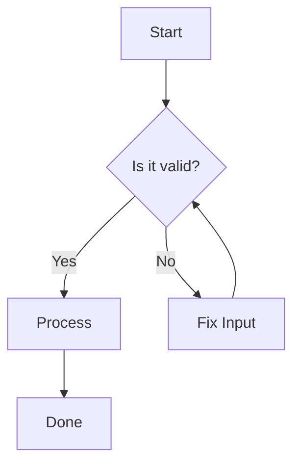
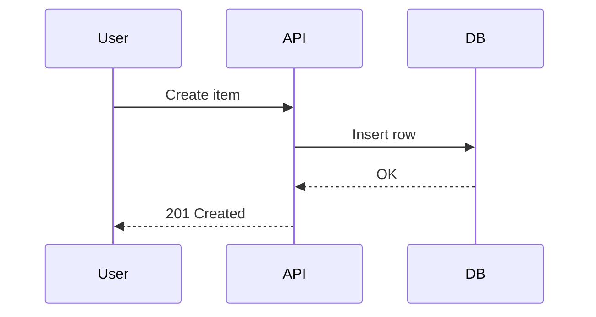

# Mermaid Samples

## Flowchart Example

```mermaid
flowchart TD
  A[Start] --> B{Is it valid?}
  B -->|Yes| C[Process]
  B -->|No| D[Fix Input]
  D --> B
  C --> E[Done]
```

## Sequence Diagram Example

```mermaid
sequenceDiagram
  participant User
  participant API
  participant DB

  User->>API: Create item
  API->>DB: Insert row
  DB-->>API: OK
  API-->>User: 201 Created
```
