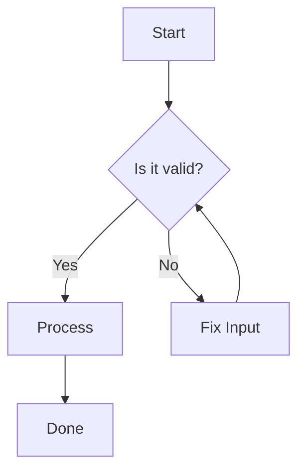
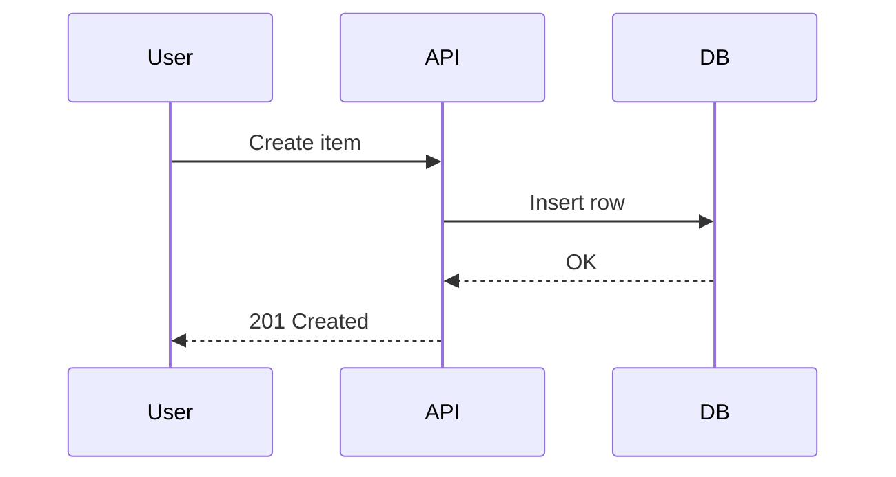
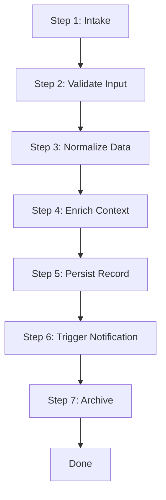

# Mermaid Samples

## Flowchart Example

### Flowchart SVG (Generated with Node Mermaid.js)

## Sequence Diagram Example

### Sequence SVG (Generated with Node Mermaid.js)

## Long Vertical Flowchart Example

### Long Vertical Flowchart SVG (Generated with Node Mermaid.js)

